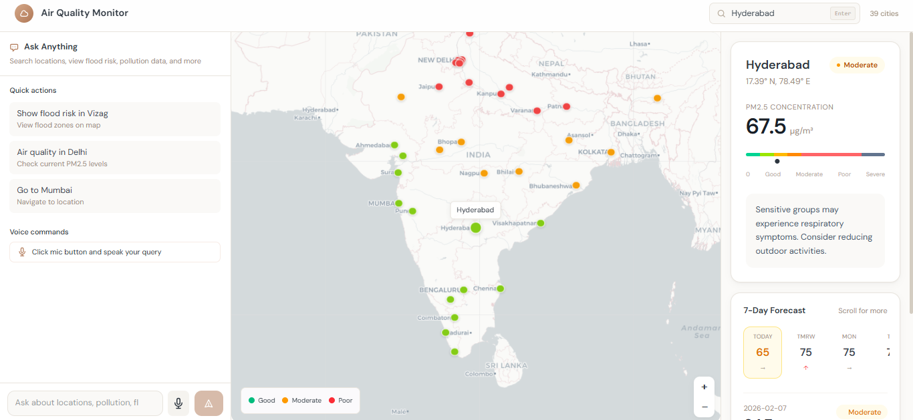

🌍 Air Quality Monitor with Voice Assistant & Chatbot
This project is a smart web application that helps users check air quality levels for different cities using text, voice commands, and a chatbot interface.
It provides real-time pollution details like PM2.5 concentration and clearly explains air quality status such as Good, Moderate, or Poor in an easy-to-understand way.
The goal of this project is to make air pollution data more interactive, accessible, and user-friendly through voice interaction and conversational AI.

1. What this project does

🎤 Allows users to check air quality using voice commands (e.g., “What’s the air quality in Delhi?”)

🤖 Provides a chatbot to answer air quality–related questions

🌆 Enables users to search air quality by city name

📊 Shows real-time PM2.5 pollution levels
🚦 Displays air quality status (Good / Moderate / Poor)

🧠 Explains pollution levels in simple language for better understanding 

2.Technologies used
- *Frontend:* HTML, CSS, JavaScript  
- *Backend:* Python with FastAPI  
- *APIs:* Air quality / pollution data APIs  
- *Maps & Visualization:* Interactive map layers

3.How to Use

1. Clone or download the repository from GitHub.
2. Make sure Python is installed on your system.
3. Install the required dependencies using:
   pip install -r requirements.txt
4. Run the backend server:
   python main.py
5. Open the browser and go to:
   http://localhost:5174
6. Search for a city to view real-time air quality data.

4. Project Screenshot
Below is a screenshot of the application running locally:

5.Author
Tabitha Battula 
Final Year Student  
GitHub: https://github.com/TabithaBattula
